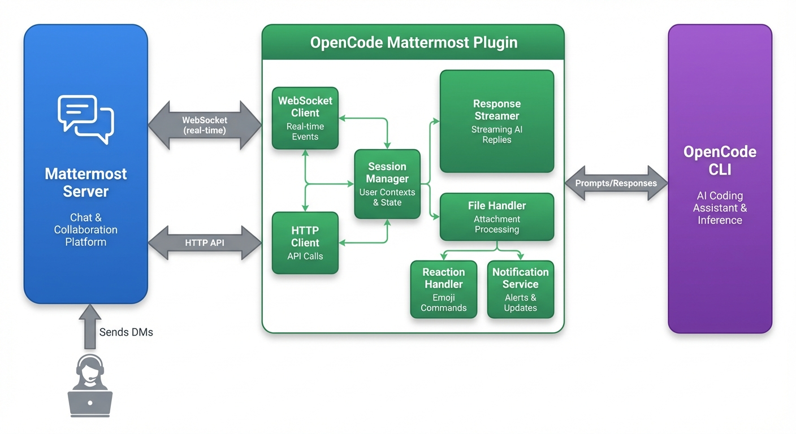

# OpenCode Mattermost Control Plugin

[](https://opensource.org/licenses/MIT)
[](https://www.npmjs.com/package/opencode-mattermost-control)

Control [OpenCode](https://opencode.ai) remotely via Mattermost direct messages. Send prompts to your OpenCode session by messaging a bot user, and receive real-time streaming responses.

## Features

- **Remote Control**: Send prompts to OpenCode via Mattermost DMs
- **Multi-Session Management**: Switch between multiple OpenCode sessions from Mattermost
- **Session Monitoring**: Get DM alerts when sessions need attention (permission requests, idle, questions)
- **Real-time Streaming**: Responses stream back in chunks with intelligent buffering
- **File Attachments**: Send and receive files through Mattermost
- **Emoji Commands**: React with emojis to control sessions
  - ✅ Approve pending permission
  - ❌ Deny pending permission  
  - 🛑 Cancel current operation
  - 🔁 Retry last prompt
  - 🗑️ Clear session files
- **Notifications**: Get notified on completion, errors, and status changes
- **Multi-user Support**: Handle multiple users with separate sessions
- **Automatic Reconnection**: WebSocket auto-reconnects with exponential backoff

---

## Quick Start for Humans

### Prerequisites

- [OpenCode](https://opencode.ai) installed and configured
- A Mattermost instance with API access
- A Mattermost bot account with appropriate permissions
- [Bun](https://bun.sh) runtime (recommended) or Node.js 18+

### Step 1: Install the Plugin

```bash
# Using bun (recommended)
bun add -g opencode-mattermost-control

# Or using npm
npm install -g opencode-mattermost-control
```

### Step 2: Create a Mattermost Bot

1. Go to your Mattermost **System Console** → **Integrations** → **Bot Accounts**
2. Click **Add Bot Account**
3. Give it a username (e.g., `opencode-bot`) and description
4. Copy the generated **Access Token** - you'll need this!

### Step 3: Set Environment Variables

```bash
export MATTERMOST_TOKEN="your-bot-access-token"
export MATTERMOST_URL="https://your-mattermost-instance.com/api/v4"
```

### Step 4: Connect from OpenCode

```bash
# Start OpenCode in your project
opencode

# Then type or use the tool:
mattermost_connect
```

You should see:
```
✓ Connected to Mattermost as @opencode-bot
✓ Listening for DMs
✓ Project: your-project-name
```

### Step 5: Send Prompts via DM

Open Mattermost, find your bot user, and send it a direct message:
```
Create a hello world function in Python
```

The response will stream back in real-time!

---

## Quick Start for AI Agents

If you're an AI agent setting up this plugin, follow these steps:

### 1. Install

```bash
bun add -g opencode-mattermost-control
```

### 2. Configure Environment

Set these environment variables before starting OpenCode:

```bash
export MATTERMOST_TOKEN="<bot-access-token>"
export MATTERMOST_URL="https://<mattermost-host>/api/v4"
```

### 3. Connect

Use the `mattermost_connect` tool to establish connection:

```
mattermost_connect
```

### 4. Verify Connection

Use `mattermost_status` to confirm the connection is active.

### 5. Available Tools

| Tool | Purpose |
|------|---------|
| `mattermost_connect` | Establish connection to Mattermost |
| `mattermost_disconnect` | Terminate connection |
| `mattermost_status` | Check connection state |
| `mattermost_list_sessions` | List available OpenCode sessions |
| `mattermost_select_session` | Select which session receives prompts |
| `mattermost_current_session` | Show currently targeted session |
| `mattermost_monitor` | Monitor session for events (permission, idle, question) |
| `mattermost_unmonitor` | Stop monitoring a session |

### 6. Handling DMs

Once connected, any DM sent to the bot user will appear as a prompt in your session prefixed with `[Mattermost DM from @username]:`. Process these as normal user requests.

### 7. Session Commands

Users can send these commands via DM to manage sessions:
- `!sessions` - List all available OpenCode sessions
- `!use <id>` - Switch to a specific session
- `!current` - Show currently selected session
- `!help` - Show available commands

---

## Installation Options

### Option A: Global Install (Recommended)

```bash
# Install globally with bun
bun add -g opencode-mattermost-control

# Or with npm
npm install -g opencode-mattermost-control
```

### Option B: From Source

```bash
git clone https://github.com/Shakudo-io/opencode-mattermost-plugin.git
cd opencode-mattermost-plugin
bun install
```

### Option C: Per-Project

Add to your project's `opencode.json`:

```json
{
  "$schema": "https://opencode.ai/config.json",
  "plugins": ["opencode-mattermost-control"]
}
```

---

## Configuration Reference

### Environment Variables

```bash
# Required
export MATTERMOST_TOKEN="your-bot-access-token"
export MATTERMOST_URL="https://your-mattermost-instance.com/api/v4"

# Optional (with defaults)
export MATTERMOST_WS_URL="wss://your-mattermost-instance.com/api/v4/websocket"
export MATTERMOST_TEAM="your-team-name"
export MATTERMOST_DEBUG="false"

# Advanced options
export MATTERMOST_RECONNECT_INTERVAL="5000"      # ms between reconnect attempts
export MATTERMOST_MAX_RECONNECT_ATTEMPTS="10"   # max reconnection tries

# Streaming configuration
export OPENCODE_MM_BUFFER_SIZE="50"              # characters before flushing
export OPENCODE_MM_MAX_DELAY="500"               # max ms before forced flush
export OPENCODE_MM_EDIT_RATE_LIMIT="10"          # max edits per second

# Session configuration
export OPENCODE_MM_SESSION_TIMEOUT="3600000"     # 1 hour in ms
export OPENCODE_MM_MAX_SESSIONS="50"             # max concurrent sessions
export OPENCODE_MM_ALLOWED_USERS=""              # comma-separated user IDs (empty = all)

# File handling
export OPENCODE_MM_TEMP_DIR="/tmp/opencode-mm-plugin"
export OPENCODE_MM_MAX_FILE_SIZE="10485760"      # 10MB
export OPENCODE_MM_ALLOWED_EXTENSIONS="*"        # comma-separated or * for all

# Notifications
export OPENCODE_MM_NOTIFY_COMPLETION="true"
export OPENCODE_MM_NOTIFY_PERMISSION="true"
export OPENCODE_MM_NOTIFY_ERROR="true"
export OPENCODE_MM_NOTIFY_STATUS="true"

# Logging
export MM_PLUGIN_LOG_FILE="/tmp/opencode-mattermost-plugin.log"
```

### OpenCode Configuration

Add to global config (`~/.config/opencode/opencode.json`):

```json
{
  "plugins": ["opencode-mattermost-control"]
}
```

Or per-project (`opencode.json` in project root):

```json
{
  "$schema": "https://opencode.ai/config.json",
  "plugins": ["opencode-mattermost-control"]
}
```

---

## Usage Examples

### Basic Workflow

```bash
# 1. Start OpenCode
opencode

# 2. Connect to Mattermost
> mattermost_connect
✓ Connected to Mattermost as @your-bot
✓ Listening for DMs

# 3. Check status anytime
> mattermost_status

# 4. Disconnect when done
> mattermost_disconnect
```

### Session Management Commands

When connected, you can manage multiple OpenCode sessions via DM commands:

| Command | Description |
|---------|-------------|
| `!sessions` | List all available OpenCode sessions |
| `!use <id>` | Switch to a specific session by ID or slug |
| `!current` | Show the currently selected session |
| `!help` | Display available commands |

**Example workflow:**
```
You: !sessions
Bot: 📋 Available Sessions (3)
     1. [ses_44] business-automation - 5m ago
     2. [ses_38] my-project - 2h ago  
     3. [ses_21] another-repo - 1d ago

You: !use ses_38
Bot: ✓ Switched to session: my-project

You: What files are in this project?
Bot: [Response from ses_38 session...]
```

### Emoji Commands

React to any bot message with these emojis:

| Emoji | Action |
|-------|--------|
| ✅ | Approve pending permission request |
| ❌ | Deny pending permission request |
| 🛑 | Cancel current operation |
| 🔁 | Retry the last prompt |
| 🗑️ | Clear session temporary files |

### Session Monitoring

Monitor OpenCode sessions and receive DM alerts when they need attention. Works without requiring an active Mattermost connection.

```bash
# Start monitoring the current session
> /mattermost-monitor

# Or use the tool directly
> mattermost_monitor targetUser="your-username"

# Stop monitoring
> mattermost_unmonitor
```

**Alert types:**
- **Permission requested** - Session is waiting for permission approval
- **Session idle** - Session finished and is waiting for input
- **Question asked** - Session is asking a clarifying question

**Example alert:**
```
🔔 OpenCode Session Alert

Project: business-automation
Session: ses_4426 - Mattermost plugin codebase review
Directory: /root/gitrepos/business-automation

⏳ Alert: Session is idle (waiting for input)

Use `!use ses_4426` in DM to connect to this session.
```

**Options:**
- `sessionId` - Monitor a specific session (defaults to current)
- `targetUser` - Mattermost username to notify (required if not connected)
- `persistent` - Keep monitoring after each alert (default: true). Set to false for one-time alerts.

## Architecture



**Data Flow:**
1. User sends a DM to the bot in Mattermost
2. Plugin receives the message via WebSocket
3. Plugin forwards the prompt to OpenCode CLI
4. OpenCode processes and streams responses back
5. Plugin delivers chunked responses to Mattermost DM

### Components

| Component | Description |
|-----------|-------------|
| `MattermostClient` | HTTP API client for posts, channels, files, reactions |
| `WebSocketClient` | Real-time event streaming for instant message detection |
| `SessionManager` | Per-user session tracking with timeout management |
| `OpenCodeSessionRegistry` | Discovers and tracks all available OpenCode sessions |
| `CommandHandler` | Processes `!commands` for session management |
| `ResponseStreamer` | Chunked message delivery to Mattermost |
| `NotificationService` | Completion, error, and status notifications |
| `FileHandler` | Inbound/outbound file attachment processing |
| `ReactionHandler` | Emoji-based command execution |
| `MonitorService` | Session event monitoring and DM alerts |

## Project Structure

```
opencode-mattermost-plugin/
├── package.json
├── tsconfig.json
├── opencode.json
├── .opencode/
│   └── plugin/
│       └── mattermost-control/
│           ├── index.ts              # Main plugin entry point
│           └── package.json
└── src/
    ├── clients/
    │   ├── mattermost-client.ts      # HTTP API client
    │   └── websocket-client.ts       # WebSocket client
    ├── command-handler.ts            # !command processing
    ├── config.ts                     # Configuration loading
    ├── file-handler.ts               # File uploads/downloads
    ├── logger.ts                     # File-based logging
    ├── models/index.ts               # TypeScript types
    ├── monitor-service.ts            # Session monitoring and alerts
    ├── notification-service.ts       # Status notifications
    ├── opencode-session-registry.ts  # OpenCode session discovery
    ├── reaction-handler.ts           # Emoji reaction handling
    ├── response-streamer.ts          # Streams responses to MM
    └── session-manager.ts            # User session management
```

## Troubleshooting

### "Not connected to Mattermost"
Run `mattermost_connect` first.

### "MATTERMOST_TOKEN environment variable is required"
Set the `MATTERMOST_TOKEN` environment variable with your bot's access token.

### WebSocket disconnects frequently
Check network connectivity to the Mattermost server. The client auto-reconnects with exponential backoff.

### Messages not appearing
Ensure you're DMing the bot user directly, not posting in a channel.

### Permission errors
Verify your bot token has the required permissions:
- Post messages
- Read channels
- Upload files (if using file attachments)

### View logs
```bash
tail -f /tmp/opencode-mattermost-plugin.log
```

## Development

### Setup

```bash
git clone https://github.com/Shakudo-io/opencode-mattermost-plugin.git
cd opencode-mattermost-plugin
bun install
```

### Type Check

```bash
bun run typecheck
```

### Run Tests

```bash
bun test
```

### Publish

```bash
npm publish
```

## Contributing

Contributions are welcome! Please feel free to submit a Pull Request.

1. Fork the repository
2. Create your feature branch (`git checkout -b feature/amazing-feature`)
3. Commit your changes (`git commit -m 'Add some amazing feature'`)
4. Push to the branch (`git push origin feature/amazing-feature`)
5. Open a Pull Request

### Guidelines

- Follow the existing code style
- Add tests for new features
- Update documentation as needed
- Keep commits atomic and well-described

## Security

- Never commit tokens or credentials
- Use environment variables for all sensitive configuration
- Report security vulnerabilities privately

## License

MIT License - see [LICENSE](LICENSE) for details.

## Links

- [OpenCode Documentation](https://opencode.ai/docs/)
- [Mattermost API Reference](https://api.mattermost.com/)
- [Report Issues](https://github.com/Shakudo-io/opencode-mattermost-plugin/issues)
