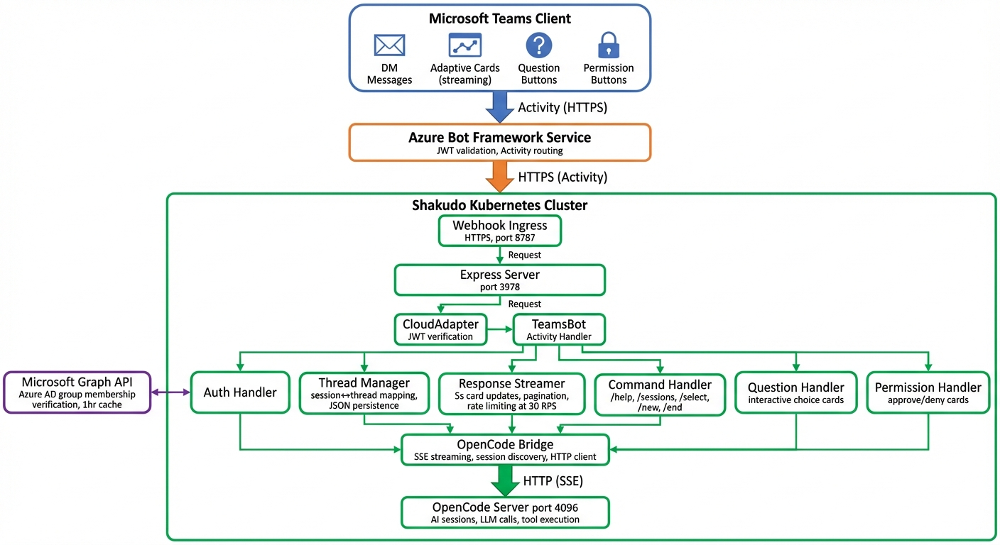

# MS Teams OpenCode Bot - Architecture Documentation

**Document Version**: 2026-02-11  
**Component**: OpenCode MS Teams Integration  
**Repository**: opencode-mattermost-plugin (teams integration branch)

---

## Table of Contents

1. [Overview](#overview)
2. [High-Level Architecture](#high-level-architecture)
3. [Component Inventory](#component-inventory)
4. [Message Flow](#message-flow)
5. [Streaming Response Lifecycle](#streaming-response-lifecycle)
6. [Authentication Flow](#authentication-flow)
7. [Interactive Flows](#interactive-flows)
8. [Session Lifecycle](#session-lifecycle)
9. [Deployment Topology](#deployment-topology)
10. [Key Design Decisions](#key-design-decisions)
11. [Configuration Reference](#configuration-reference)
12. [Security Model](#security-model)

---

## Overview

The MS Teams OpenCode bot integration enables users to interact with OpenCode AI coding assistant directly within Microsoft Teams. The architecture implements a webhook-based bot using Azure Bot Framework, with streaming responses, Azure AD group authorization, and persistent session management.

**Key Characteristics**:
- **Protocol**: Azure Bot Framework webhook (HTTP POST to `/api/messages`)
- **Authentication**: Azure AD group membership check via Microsoft Graph API
- **Response Model**: Server-Sent Events (SSE) from OpenCode, polled and streamed to Teams via Adaptive Cards
- **Session Management**: Thread-scoped sessions with persistent mapping to OpenCode sessions
- **Deployment**: Shakudo microservice with external webhook ingress

---

## High-Level Architecture



```
┌─────────────────┐
│  Teams Client   │
│  (Desktop/Web)  │
└────────┬────────┘
         │ User message: "@OpenCode help me debug"
         ↓
┌─────────────────────────────────────────────────────┐
│     Azure Bot Framework Service (bot.azure.com)     │
│  - JWT signature validation (Bot Framework tokens)  │
│  - Message routing to bot webhook endpoint          │
└────────────────────┬────────────────────────────────┘
                     │ HTTPS POST with JWT
                     ↓
┌──────────────────────────────────────────────────────┐
│  Shakudo Webhook Ingress (dev.hyperplane.dev)       │
│  URL: https://bc2cc691-...webhook.dev.hyperplane.dev│
│  Port mapping: 8787 (external) → 3978 (internal)    │
└────────────────────┬─────────────────────────────────┘
                     │
                     ↓
┌──────────────────────────────────────────────────────┐
│         Express Server (teams-server.ts)             │
│  - POST /api/messages (webhook endpoint)            │
│  - GET /api/health (health check)                   │
│  - Port 3978 (internal)                             │
└────────────────────┬─────────────────────────────────┘
                     │
                     ↓
┌──────────────────────────────────────────────────────┐
│     CloudAdapter (teams-adapter.ts)                  │
│  - BotFramework authentication (appId/appPassword)  │
│  - Activity deserialization                         │
│  - Turn context creation                            │
└────────────────────┬─────────────────────────────────┘
                     │
                     ↓
┌──────────────────────────────────────────────────────┐
│      TeamsBot (teams-bot.ts)                         │
│  - onMessage(): User text input routing             │
│  - onInvokeActivity(): Card action routing          │
│  - Command handling via TeamsCommandHandler         │
└────────┬───────────────────────┬─────────────────────┘
         │                       │
         │ Auth check            │ Card actions
         ↓                       ↓
┌────────────────────┐  ┌────────────────────────────┐
│ TeamsAuthHandler   │  │ TeamsQuestionHandler       │
│ (teams-auth.ts)    │  │ (teams-question-handler.ts)│
│                    │  │                            │
│ - Azure AD group   │  │ - AI question approval     │
│   check via        │  │ - Option selection routing │
│   Graph API        │  └────────────────────────────┘
│ - 1hr cache        │
│ - Fail-closed      │  ┌────────────────────────────┐
└────────────────────┘  │ TeamsPermissionHandler     │
                        │ (teams-permission-..ts)    │
                        │                            │
                        │ - Tool permission approval │
                        │ - Approve/deny/all routing │
                        └────────────────────────────┘
         │
         │ Authorized user
         ↓
┌──────────────────────────────────────────────────────┐
│   TeamsThreadManager (teams-thread-manager.ts)       │
│  - Session-to-thread mapping                        │
│  - Thread lifecycle management                      │
│  - Persistent storage: ~/.config/opencode/          │
│    teams-thread-mappings.json                       │
└────────────────────┬─────────────────────────────────┘
                     │
                     ↓
┌──────────────────────────────────────────────────────┐
│  TeamsResponseStreamer (teams-response-streamer.ts)  │
│  - 5000ms polling interval (default)                │
│  - StatusCard updates (processing indicator)        │
│  - ResponseCard rendering (final result)            │
│  - Pagination for >20KB content                     │
└────────────────────┬─────────────────────────────────┘
                     │
                     ↓
┌──────────────────────────────────────────────────────┐
│     OpenCodeBridge (opencode-bridge.ts)              │
│  - HTTP client to OpenCode server                   │
│  - SSE stream parsing                               │
│  - URL: http://localhost:4096 (default)             │
└────────────────────┬─────────────────────────────────┘
                     │
                     ↓
┌──────────────────────────────────────────────────────┐
│           OpenCode Server (localhost:4096)           │
│  - POST /v1/sessions/{id}/messages                  │
│  - POST /v1/sessions/{id}/approve-permission        │
│  - POST /v1/sessions/{id}/answer-question           │
│  - SSE streaming response format                    │
└──────────────────────────────────────────────────────┘
```

---

## Component Inventory

| File Path | Component | Responsibility |
|-----------|-----------|----------------|
| **Core Bot** | | |
| `src/teams/index.ts` | `startTeamsBot()` | Main entry point, initializes all components |
| `src/teams/teams-bot.ts` | `TeamsBot` (extends `TeamsActivityHandler`) | Message routing, card action routing, command handling |
| `src/teams/teams-server.ts` | `createTeamsServer()` | Express server, webhook endpoint, health check |
| `src/teams/teams-adapter.ts` | `createTeamsAdapter()` | CloudAdapter initialization, BotFramework auth |
| **Authentication** | | |
| `src/teams/teams-auth.ts` | `TeamsAuthHandler` | Azure AD group check via Graph API, 1hr cache |
| **Session Management** | | |
| `src/teams/teams-thread-manager.ts` | `TeamsThreadManager` | Thread-to-session mapping, thread lifecycle |
| `src/persistence/teams-thread-mapping-store.ts` | `TeamsThreadMappingStore` | JSON file persistence (`~/.config/opencode/teams-thread-mappings.json`) |
| **Response Streaming** | | |
| `src/teams/teams-response-streamer.ts` | `TeamsResponseStreamer` | 5s polling, StatusCard updates, ResponseCard rendering |
| `src/teams/opencode-bridge.ts` | `OpenCodeBridge` | HTTP client to OpenCode server, SSE parsing |
| **Interactive Flows** | | |
| `src/teams/teams-question-handler.ts` | `TeamsQuestionHandler` | AI question approval, option selection routing |
| `src/teams/teams-permission-handler.ts` | `TeamsPermissionHandler` | Tool permission approval, approve/deny/all routing |
| `src/teams/teams-command-handler.ts` | `TeamsCommandHandler` | Command routing (`/new`, `/list`, `/switch`, `/help`, `/whoami`) |
| **Adaptive Cards** | | |
| `src/teams/cards/status-card.ts` | `createStatusCard()` | Processing status card (shown during streaming) |
| `src/teams/cards/response-card.ts` | `createResponseCard()` | Final response card with pagination (>20KB) |
| `src/teams/cards/index.ts` | Card exports | Central export point for all card types |
| **Configuration** | | |
| `src/teams/teams-config.ts` | `TeamsConfig` (Zod schema) | Configuration schema with defaults |
| **Type Definitions** | | |
| `src/models/teams-types.ts` | TypeScript interfaces | `TeamsThreadMapping`, `OpenCodeMessageEvent`, Zod schemas |

---

## Message Flow

### User Message: "@OpenCode help me debug this function"

```
Step 1: User sends message in Teams
────────────────────────────────────────────────────────────
  Teams Client → Azure Bot Framework Service
  - User types: "@OpenCode help me debug this function"
  - Teams client sends Activity to Azure Bot Framework

Step 2: Azure validates and routes
────────────────────────────────────────────────────────────
  Azure Bot Framework Service → Shakudo Webhook
  - Validates JWT signature (Bot Framework token)
  - Routes to webhook: POST https://bc2cc691-...webhook.dev.hyperplane.dev/api/messages
  - Includes Activity JSON: { type: "message", text: "...", from: {...}, conversation: {...} }

Step 3: Shakudo ingress forwards to Express
────────────────────────────────────────────────────────────
  Shakudo Webhook (port 8787) → Express Server (port 3978)
  - Port mapping: external 8787 → internal 3978
  - POST /api/messages received by Express

Step 4: CloudAdapter authenticates and deserializes
────────────────────────────────────────────────────────────
  Express → CloudAdapter.processActivity()
  - Authenticates request using appId/appPassword
  - Deserializes Activity JSON
  - Creates TurnContext with conversation reference

Step 5: TeamsBot receives activity
────────────────────────────────────────────────────────────
  CloudAdapter → TeamsBot.onMessage()
  - Extracts text: "help me debug this function"
  - Extracts user ID, conversation ID, thread root message ID

Step 6: Auth check
────────────────────────────────────────────────────────────
  TeamsBot → TeamsAuthHandler.checkAuthorization()
  - Gets user's Azure AD object ID from Activity
  - Checks cache (1hr TTL)
  - If not cached: calls Graph API /v1.0/users/{userId}/checkMemberGroups
  - If user NOT in authorized group: sends "Unauthorized" card, returns
  - If authorized: proceeds

Step 7: Thread/session mapping
────────────────────────────────────────────────────────────
  TeamsBot → TeamsThreadManager.getOrCreateThread()
  - Looks up thread by threadRootMessageId in JSON store
  - If not found: creates new OpenCode session via OpenCodeBridge.createSession()
  - Stores mapping: threadRootMessageId → openCodeSessionId
  - Returns TeamsThreadMapping

Step 8: Send message to OpenCode
────────────────────────────────────────────────────────────
  TeamsBot → TeamsResponseStreamer.streamResponse()
  ├─ Sends initial StatusCard: "Processing your request..."
  └─ Calls OpenCodeBridge.sendMessage(sessionId, "help me debug this function")
      └─ POST http://localhost:4096/v1/sessions/{sessionId}/messages
         Body: { content: "help me debug this function", stream: true }

Step 9: OpenCode streams response
────────────────────────────────────────────────────────────
  OpenCodeBridge → Parses SSE stream
  - data: {"type":"start","timestamp":"..."}
  - data: {"type":"text","text":"Let me help","timestamp":"..."}
  - data: {"type":"text","text":" you debug","timestamp":"..."}
  - data: {"type":"tool_use","id":"...","name":"read","input":{...}}
  - data: {"type":"tool_result","tool_use_id":"...","content":"..."}
  - data: {"type":"text","text":"I see the issue","timestamp":"..."}
  - data: {"type":"done"}

Step 10: ResponseStreamer polls and updates card
────────────────────────────────────────────────────────────
  TeamsResponseStreamer (5000ms interval)
  ├─ Every 5s: checks OpenCodeBridge.getAccumulatedResponse()
  ├─ If response changed: updates StatusCard with latest text
  └─ On "done" event:
      ├─ Creates ResponseCard with full response
      ├─ If >20KB: paginates into multiple cards
      └─ Sends final card(s) to Teams via TurnContext.updateActivity()

Step 11: User sees final response
────────────────────────────────────────────────────────────
  Teams Client displays ResponseCard
  - Shows full AI response with formatted markdown
  - Includes tool outputs if any
  - Pagination buttons if >20KB
```

---

## Streaming Response Lifecycle

### Polling-Based Streaming (5000ms interval)

```
Time: 0ms
───────────────────────────────────────────────────────────
  User message received
  ↓
  TeamsResponseStreamer.streamResponse() called
  ↓
  Initial StatusCard sent: "🤖 Processing your request..."
  ↓
  OpenCodeBridge.sendMessage() initiates SSE stream

Time: 0-5000ms (First interval)
───────────────────────────────────────────────────────────
  SSE events arrive from OpenCode:
    - data: {"type":"start"}
    - data: {"type":"text","text":"Let me help"}
    - data: {"type":"text","text":" you with"}
    - data: {"type":"text","text":" that."}
  
  OpenCodeBridge accumulates text: "Let me help you with that."
  
  (No card update yet - waiting for 5000ms interval)

Time: 5000ms (First poll)
───────────────────────────────────────────────────────────
  TeamsResponseStreamer checks accumulated response
  ↓
  Response changed: "Let me help you with that."
  ↓
  StatusCard updated:
    Title: "🤖 Processing..."
    Body: "Let me help you with that."

Time: 5000-10000ms (Second interval)
───────────────────────────────────────────────────────────
  SSE events continue:
    - data: {"type":"tool_use","name":"read","input":{...}}
    - data: {"type":"text","text":" I need to"}
    - data: {"type":"text","text":" check the code."}
  
  OpenCodeBridge accumulates: "Let me help you with that. I need to check the code."
  
  (Waiting for next poll)

Time: 10000ms (Second poll)
───────────────────────────────────────────────────────────
  Response changed: "Let me help you with that. I need to check the code."
  ↓
  StatusCard updated with new accumulated text

Time: 10000-15000ms (Third interval)
───────────────────────────────────────────────────────────
  SSE events continue:
    - data: {"type":"tool_result","content":"<file contents>"}
    - data: {"type":"text","text":" I see the issue"}
    - data: {"type":"text","text":" on line 42."}
    - data: {"type":"done"}
  
  OpenCodeBridge detects "done" event
  ↓
  Final accumulated text: "Let me help you with that. I need to check the code. I see the issue on line 42."

Time: 15000ms (Third poll - FINAL)
───────────────────────────────────────────────────────────
  TeamsResponseStreamer detects stream completed
  ↓
  Calls OpenCodeBridge.getFullResponse()
  ↓
  Constructs ResponseCard:
    - Full text content
    - Tool outputs (read result)
    - Pagination if >20KB (MAX_CONTENT_LENGTH = 20000 chars)
  ↓
  Replaces StatusCard with ResponseCard
  ↓
  Stream lifecycle complete
```

### Card Size Management

```
Response text length check:
────────────────────────────────────────────────────────────
  content.length <= 20000 chars (MAX_CONTENT_LENGTH)
    ↓ YES
    Single ResponseCard with full content
    
  content.length > 20000 chars
    ↓ NO
    Split into pages:
      - Page 1: chars 0-20000
      - Page 2: chars 20000-40000
      - Page 3: chars 40000-60000
      - ...
    
    First ResponseCard includes:
      - Page 1 content
      - "Showing page 1 of N" footer
      - [Next Page] button (if more pages exist)
    
    User clicks [Next Page]:
      ↓
      Card action: { type: "invoke", value: { action: "nextPage", page: 2 } }
      ↓
      TeamsBot.onInvokeActivity() routes to pagination handler
      ↓
      New ResponseCard sent with page 2 content

Adaptive Card size validation:
────────────────────────────────────────────────────────────
  JSON.stringify(card).length < 25000 bytes (TEAMS_MAX_CARD_SIZE)
    ↓ YES
    Send card
    
  JSON.stringify(card).length >= 25000 bytes
    ↓ NO
    Truncate content and add "Response too large" message
```

---

## Authentication Flow

### Azure AD Group Membership Check

```
User sends first message in thread
  ↓
TeamsBot.onMessage() receives Activity
  ↓
Extract user Azure AD object ID from Activity.from.aadObjectId
  ↓
TeamsAuthHandler.checkAuthorization(userId)
  ↓
  ┌─────────────────────────────────────┐
  │ Check in-memory cache               │
  │ Key: userId                         │
  │ TTL: 3600000ms (1 hour)             │
  └─────────┬───────────────────────────┘
            │
            ↓
  Cache hit? ────YES──→ Return cached result (authorized: true/false)
            │
            NO
            ↓
  ┌─────────────────────────────────────────────────────────┐
  │ Microsoft Graph API Call                                │
  │                                                          │
  │ Step 1: Get access token (client credentials flow)      │
  │   POST https://login.microsoftonline.com/{tenantId}/    │
  │        oauth2/v2.0/token                                │
  │   Body:                                                  │
  │     grant_type=client_credentials                       │
  │     client_id={AZURE_APP_ID}                            │
  │     client_secret={AZURE_APP_PASSWORD}                  │
  │     scope=https://graph.microsoft.com/.default          │
  │                                                          │
  │ Step 2: Check group membership                          │
  │   POST https://graph.microsoft.com/v1.0/users/{userId}/ │
  │        checkMemberGroups                                │
  │   Headers:                                               │
  │     Authorization: Bearer {access_token}                │
  │   Body:                                                  │
  │     { "groupIds": ["{AZURE_AUTHORIZED_GROUP_ID}"] }     │
  │                                                          │
  │ Response:                                                │
  │   { "value": ["group-id-1", "group-id-2", ...] }        │
  └─────────┬───────────────────────────────────────────────┘
            │
            ↓
  Check if AZURE_AUTHORIZED_GROUP_ID in response.value
            │
            ├─ YES ──→ authorized = true
            │
            └─ NO ───→ authorized = false
            │
            ↓
  Store in cache (1hr TTL)
            │
            ↓
  Return authorization result
            │
            ↓
  ┌─────────────────────────────────────┐
  │ Authorized = true                   │
  │   ↓                                 │
  │ Proceed with message processing     │
  └─────────────────────────────────────┘
            │
            OR
            │
  ┌─────────────────────────────────────┐
  │ Authorized = false                  │
  │   ↓                                 │
  │ Send "Unauthorized" card            │
  │   ↓                                 │
  │ Log unauthorized attempt            │
  │   ↓                                 │
  │ Return (no further processing)      │
  └─────────────────────────────────────┘

Error Handling (fail-closed):
────────────────────────────────────────────────────────────
  Graph API call fails (network error, 401, 403, 500, etc.)
    ↓
  Log error with details
    ↓
  Treat as unauthorized (fail-closed security model)
    ↓
  Send "Authorization check failed" card to user
    ↓
  Return false (user cannot proceed)
```

### Environment Variables for Auth

```bash
# Required for Azure AD authentication
AZURE_APP_ID=691f2047-0585-4566-9129-d582c82b5e7d
AZURE_APP_PASSWORD=<secret-from-azure-portal>
AZURE_TENANT_ID=<tenant-id>
AZURE_AUTHORIZED_GROUP_ID=<azure-ad-security-group-id>

# Cache configuration
TEAMS_AUTH_CACHE_DURATION_MS=3600000  # 1 hour (default)
```

---

## Interactive Flows

### AI Question Flow

```
OpenCode AI needs user input
  ↓
OpenCode sends SSE event:
  data: {
    "type": "question",
    "id": "q123",
    "question": "Which database should I use?",
    "options": [
      {"label": "PostgreSQL", "description": "Relational DB"},
      {"label": "MongoDB", "description": "Document DB"}
    ]
  }
  ↓
TeamsResponseStreamer detects question event
  ↓
TeamsQuestionHandler.handleQuestion()
  ├─ Stores question in memory (TTL: 1800000ms = 30 min)
  └─ Creates Adaptive Card with:
      - Question text: "Which database should I use?"
      - Action.Submit buttons for each option:
          [PostgreSQL] [MongoDB] [Type your own]
  ↓
Card sent to Teams thread
  ↓
User clicks [PostgreSQL]
  ↓
Teams sends invoke activity:
  {
    "type": "invoke",
    "name": "adaptiveCard/action",
    "value": {
      "action": "answerQuestion",
      "questionId": "q123",
      "answer": "PostgreSQL"
    }
  }
  ↓
TeamsBot.onInvokeActivity() routes to TeamsQuestionHandler
  ↓
TeamsQuestionHandler validates:
  ├─ Question exists in memory? (not expired)
  ├─ Question belongs to this thread's session?
  └─ Answer is valid option?
  ↓
OpenCodeBridge.answerQuestion(sessionId, questionId, "PostgreSQL")
  ↓
POST http://localhost:4096/v1/sessions/{sessionId}/answer-question
  Body: { questionId: "q123", answer: "PostgreSQL" }
  ↓
OpenCode continues execution with user's answer
  ↓
TeamsResponseStreamer resumes streaming response
```

### Permission Approval Flow

```
OpenCode AI attempts restricted tool
  ↓
OpenCode sends SSE event:
  data: {
    "type": "permission_request",
    "id": "perm456",
    "tool": "bash",
    "description": "Execute: rm -rf /tmp/old-files",
    "risk": "high"
  }
  ↓
TeamsResponseStreamer detects permission_request event
  ↓
TeamsPermissionHandler.handlePermissionRequest()
  ├─ Stores request in memory (TTL: 300000ms = 5 min)
  └─ Creates Adaptive Card with:
      - Tool name: "bash"
      - Command preview: "rm -rf /tmp/old-files"
      - Risk level: "high"
      - Action.Submit buttons:
          [Approve Once] [Deny] [Approve All for Session]
  ↓
Card sent to Teams thread
  ↓
User clicks [Approve Once]
  ↓
Teams sends invoke activity:
  {
    "type": "invoke",
    "name": "adaptiveCard/action",
    "value": {
      "action": "approvePermission",
      "permissionId": "perm456",
      "decision": "approve"
    }
  }
  ↓
TeamsBot.onInvokeActivity() routes to TeamsPermissionHandler
  ↓
TeamsPermissionHandler validates:
  ├─ Request exists in memory? (not expired)
  ├─ Request belongs to this thread's session?
  └─ User who clicked is authorized?
  ↓
OpenCodeBridge.approvePermission(sessionId, permissionId, "approve")
  ↓
POST http://localhost:4096/v1/sessions/{sessionId}/approve-permission
  Body: { permissionId: "perm456", approved: true }
  ↓
OpenCode executes tool with user approval
  ↓
TeamsResponseStreamer resumes streaming response

Alternative: User clicks [Approve All for Session]
  ↓
TeamsPermissionHandler:
  ├─ Marks thread as "approve all" in TeamsThreadMapping
  ├─ Updates JSON store
  └─ All future permission requests auto-approved
  ↓
POST /approve-permission with approved: true
  ↓
OpenCode continues without further prompts
```

### Command Flow

```
User sends: "/help"
  ↓
TeamsBot.onMessage() detects command (starts with "/")
  ↓
TeamsCommandHandler.handleCommand("/help")
  ↓
Switch on command:
  ├─ "/new" → Creates new thread, new OpenCode session
  │            Returns: "Started new conversation. Session ID: {id}"
  │
  ├─ "/list" → Lists all threads for this conversation
  │            Returns: Adaptive Card with thread list
  │
  ├─ "/switch {id}" → Switches to existing thread/session
  │                   Returns: "Switched to session {id}"
  │
  ├─ "/help" → Returns help card with command reference
  │
  └─ "/whoami" → Returns user's Azure AD object ID + auth status
                 Returns: "User ID: {id}, Authorized: {true/false}"
  ↓
Response card sent to thread
```

---

## Session Lifecycle

### Thread-Scoped Sessions

```
Teams Conversation Model:
────────────────────────────────────────────────────────────
  Conversation (1:1 DM or group chat)
    ├─ Thread 1 (root message ID: "msg-abc-123")
    │    ├─ Message 1: "@OpenCode help me"
    │    ├─ Message 2: (bot response)
    │    └─ Message 3: "thanks"
    │
    └─ Thread 2 (root message ID: "msg-def-456")
         ├─ Message 1: "@OpenCode debug this"
         └─ Message 2: (bot response)

OpenCode Session Mapping:
────────────────────────────────────────────────────────────
  Thread 1 (msg-abc-123) → OpenCode Session A (session-111)
  Thread 2 (msg-def-456) → OpenCode Session B (session-222)

Invariant: One Teams thread = One OpenCode session
```

### Session Creation

```
User sends first message in NEW thread
  ↓
TeamsThreadManager.getOrCreateThread(threadRootMessageId)
  ↓
Check JSON store for existing mapping
  ↓
  Not found (new thread)
    ↓
  OpenCodeBridge.createSession()
    ↓
  POST http://localhost:4096/v1/sessions
    Body: { initial_context: {...} }
    Response: { session_id: "session-abc-123" }
  ↓
  Create TeamsThreadMapping:
    {
      id: "uuid-generated",
      threadRootMessageId: "msg-abc-123",
      conversationId: "conv-xyz",
      openCodeSessionId: "session-abc-123",
      teamsUserId: "user-aad-id",
      conversationReference: {...},
      mode: "normal",
      metadata: {},
      approvedUsers: [],
      approveAll: false,
      createdAt: "2026-02-11T04:00:00Z",
      updatedAt: "2026-02-11T04:00:00Z"
    }
  ↓
  Save to JSON store: ~/.config/opencode/teams-thread-mappings.json
  ↓
  Return mapping
```

### Session Reuse

```
User sends message in EXISTING thread
  ↓
TeamsThreadManager.getOrCreateThread(threadRootMessageId)
  ↓
Check JSON store for existing mapping
  ↓
  Found (existing thread)
    ↓
  Return existing TeamsThreadMapping
    ↓
  TeamsBot uses openCodeSessionId for subsequent messages
    ↓
  POST http://localhost:4096/v1/sessions/{openCodeSessionId}/messages
```

### Persistent Storage Schema

```json
// File: ~/.config/opencode/teams-thread-mappings.json
{
  "version": "1.0",
  "mappings": [
    {
      "id": "uuid-1",
      "threadRootMessageId": "msg-abc-123",
      "conversationId": "conv-xyz",
      "openCodeSessionId": "session-111",
      "teamsUserId": "user-aad-id-1",
      "conversationReference": {
        "activityId": "msg-abc-123",
        "user": { "id": "user-teams-id-1", "aadObjectId": "user-aad-id-1" },
        "bot": { "id": "bot-id" },
        "conversation": { "id": "conv-xyz", "tenantId": "tenant-id" },
        "channelId": "msteams",
        "serviceUrl": "https://smba.trafficmanager.net/amer/"
      },
      "mode": "normal",
      "metadata": {},
      "approvedUsers": [],
      "approveAll": false,
      "createdAt": "2026-02-11T04:00:00.000Z",
      "updatedAt": "2026-02-11T04:00:00.000Z"
    },
    {
      "id": "uuid-2",
      "threadRootMessageId": "msg-def-456",
      "conversationId": "conv-xyz",
      "openCodeSessionId": "session-222",
      "teamsUserId": "user-aad-id-1",
      "conversationReference": { /* ... */ },
      "mode": "normal",
      "metadata": {},
      "approvedUsers": [],
      "approveAll": true,
      "createdAt": "2026-02-11T04:05:00.000Z",
      "updatedAt": "2026-02-11T04:10:00.000Z"
    }
  ]
}
```

---

## Deployment Topology

### Shakudo Microservice

```
┌───────────────────────────────────────────────────────────┐
│  Shakudo Kubernetes Cluster (dev.hyperplane.dev)         │
│                                                           │
│  Namespace: hyperplane-pipelines                          │
│                                                           │
│  ┌─────────────────────────────────────────────────────┐ │
│  │  Microservice Pod: opencode-teams-bot               │ │
│  │  ID: cb289fb5-04d0-488f-b5b8-3af6d2c92d1e           │ │
│  │                                                     │ │
│  │  Container 1: Teams Bot (Express server)           │ │
│  │    - Image: (from git: opencode-mattermost-plugin) │ │
│  │    - Port 3978 (internal)                          │ │
│  │    - Entrypoint: bun src/teams/index.ts            │ │
│  │    - Env: AZURE_*, TEAMS_*, OPENCODE_SERVER_URL    │ │
│  │                                                     │ │
│  │  Container 2: OpenCode Server (localhost sidecar)  │ │
│  │    - Image: (opencode server image)                │ │
│  │    - Port 4096 (localhost only)                    │ │
│  │    - Shared network namespace with Container 1     │ │
│  │                                                     │ │
│  │  Volume: config-volume (EmptyDir)                  │ │
│  │    - Mount: ~/.config/opencode/                    │ │
│  │    - Stores: teams-thread-mappings.json            │ │
│  └─────────────────────────────────────────────────────┘ │
│                           ↑                               │
│                           │ Port mapping                  │
│                           │                               │
│  ┌─────────────────────────────────────────────────────┐ │
│  │  Kubernetes Service (LoadBalancer)                  │ │
│  │    - External Port: 8787                            │ │
│  │    - Internal Port: 3978                            │ │
│  │    - Public URL: https://bc2cc691-56d8-425d-88b2-  │ │
│  │                   70d024e56c12-webhook.dev.hyper... │ │
│  └─────────────────────────────────────────────────────┘ │
│                           ↑                               │
└───────────────────────────┼───────────────────────────────┘
                            │
                            │ HTTPS
                            │
                  ┌─────────┴──────────┐
                  │  Azure Bot         │
                  │  Framework Service │
                  │  (bot.azure.com)   │
                  └─────────┬──────────┘
                            │
                            │ HTTPS
                            │
                    ┌───────┴────────┐
                    │  Teams Client  │
                    │  (User)        │
                    └────────────────┘
```

### Network Configuration

| Component | Address | Accessibility |
|-----------|---------|---------------|
| Express Server (internal) | `http://localhost:3978` | Pod-local only |
| OpenCode Server (internal) | `http://localhost:4096` | Pod-local only (sidecar) |
| Kubernetes Service (external) | Port 8787 → 3978 | Public (via LoadBalancer) |
| Webhook URL | `https://bc2cc691-56d8-425d-88b2-70d024e56c12-webhook.dev.hyperplane.dev` | Public (Azure Bot Framework only) |

### Azure Bot Framework Registration

| Field | Value |
|-------|-------|
| Bot Name | OpenCode MS Teams Bot |
| App ID | `691f2047-0585-4566-9129-d582c82b5e7d` |
| Messaging Endpoint | `https://bc2cc691-56d8-425d-88b2-70d024e56c12-webhook.dev.hyperplane.dev/api/messages` |
| Channels | Microsoft Teams |

---

## Key Design Decisions

### 1. Polling-Based Streaming (Not True Push)

**Decision**: Use 5000ms polling interval to check OpenCode SSE stream, update Teams card periodically.

**Rationale**:
- Teams Adaptive Cards do not support server-push updates
- Card updates require explicit `TurnContext.updateActivity()` call
- Polling provides "good enough" user experience without complex WebSocket infrastructure
- 5s interval balances responsiveness vs. API rate limits (30 RPS)

**Trade-offs**:
- **Pro**: Simple implementation, no WebSocket lifecycle management
- **Pro**: Works within Teams Adaptive Card constraints
- **Con**: Max 5s latency for user to see updates
- **Con**: Wasted polling cycles if no response changes

### 2. Thread-Scoped Sessions (Not User-Scoped)

**Decision**: Each Teams thread maps to one OpenCode session. Multiple threads in same conversation = multiple sessions.

**Rationale**:
- Mirrors Teams UX: threads are independent conversation contexts
- Allows users to have parallel coding tasks in same conversation
- Session isolation prevents context pollution between unrelated questions

**Trade-offs**:
- **Pro**: Natural UX, matches user mental model of threads
- **Pro**: Context isolation per thread
- **Con**: Cannot share context across threads (by design)

### 3. Azure AD Group Authorization (Not Per-User Whitelist)

**Decision**: Check Azure AD security group membership via Graph API, cache 1hr.

**Rationale**:
- Centralized access control in Azure AD (single source of truth)
- IT admins can manage access without code changes
- 1hr cache reduces Graph API calls (cost, latency)

**Trade-offs**:
- **Pro**: Scales to large organizations
- **Pro**: Integrates with existing identity management
- **Con**: Max 1hr delay for access revocation to take effect

### 4. JSON File Persistence (Not Database)

**Decision**: Store thread mappings in `~/.config/opencode/teams-thread-mappings.json`.

**Rationale**:
- Simple deployment: no database dependency
- Low volume: hundreds of threads, not millions
- Easy backup/restore (single JSON file)

**Trade-offs**:
- **Pro**: Zero infrastructure complexity
- **Pro**: Human-readable, easy to debug
- **Con**: Not suitable for >10K threads (file I/O bottleneck)
- **Con**: No query indexing (linear scan)

### 5. Fail-Closed Auth (Deny on Error)

**Decision**: If Graph API call fails, treat as unauthorized.

**Rationale**:
- Security-first: better to block legitimate user than allow unauthorized access
- Transient failures (network glitch) are acceptable UX trade-off for security

**Trade-offs**:
- **Pro**: No security breach from auth service downtime
- **Con**: User blocked if Graph API unavailable (rare)

### 6. Card Pagination at 20KB (Not Dynamic)

**Decision**: Split ResponseCard content at 20,000 characters, fixed threshold.

**Rationale**:
- Teams Adaptive Card size limit: 25KB JSON
- Content + card structure + formatting ≈ 5KB overhead
- 20KB content threshold provides safety margin

**Trade-offs**:
- **Pro**: Prevents "card too large" errors
- **Pro**: Predictable pagination behavior
- **Con**: May paginate unnecessarily for dense JSON responses

### 7. Sidecar OpenCode Server (Not Remote)

**Decision**: Deploy OpenCode server as localhost sidecar in same pod.

**Rationale**:
- Simplified networking: no service discovery, no auth between containers
- Low latency: localhost TCP, no network hops
- Session isolation: each bot instance has dedicated OpenCode server

**Trade-offs**:
- **Pro**: Zero network latency for bot ↔ OpenCode communication
- **Pro**: No cross-pod auth required
- **Con**: Cannot share OpenCode server across multiple bot instances

---

## Configuration Reference

### Environment Variables

| Variable | Default | Description |
|----------|---------|-------------|
| **Azure Bot Framework** | | |
| `AZURE_APP_ID` | (required) | Azure App ID (Bot Framework app registration) |
| `AZURE_APP_PASSWORD` | (required) | Azure App Password (client secret) |
| `AZURE_TENANT_ID` | (required) | Azure AD tenant ID |
| `AZURE_AUTHORIZED_GROUP_ID` | (required) | Azure AD security group ID for authorization |
| `AZURE_BOT_ENDPOINT` | (optional) | Custom bot endpoint (overrides default) |
| **Express Server** | | |
| `TEAMS_BOT_PORT` | `3978` | Express server port |
| `TEAMS_BASE_PATH` | `/api` | Base path for API routes |
| `TEAMS_HEALTH_PATH` | `/health` | Health check endpoint path |
| `TEAMS_MESSAGES_PATH` | `/messages` | Webhook endpoint path (full: `/api/messages`) |
| **Bot Behavior** | | |
| `TEAMS_CARD_UPDATE_INTERVAL` | `5000` | Polling interval for SSE stream (ms) |
| `TEAMS_MAX_CARD_SIZE` | `25000` | Max Adaptive Card JSON size (bytes) |
| `TEAMS_RATE_LIMIT` | `30` | Max messages per second (rate limit) |
| `TEAMS_AUTH_CACHE_DURATION_MS` | `3600000` | Auth result cache TTL (1 hour) |
| `TEAMS_QUESTION_EXPIRATION_MS` | `1800000` | AI question expiration (30 min) |
| `TEAMS_PERMISSION_EXPIRATION_MS` | `300000` | Permission request expiration (5 min) |
| **OpenCode Server** | | |
| `OPENCODE_SERVER_URL` | `http://localhost:4096` | OpenCode server base URL |
| `OPENCODE_CONNECTION_TIMEOUT` | `5000` | HTTP connection timeout (ms) |

### Additional Configuration Sources

| File | Purpose |
|------|---------|
| `src/teams/teams-config.ts` | Zod schema with all config validation |
| `src/teams/cards/response-card.ts` | `MAX_CONTENT_LENGTH = 20000` (pagination threshold) |
| `~/.config/opencode/teams-thread-mappings.json` | Persistent thread-to-session mappings |

---

## Security Model

### Authentication & Authorization

```
┌─────────────────────────────────────────────────────────┐
│  Layer 1: Azure Bot Framework Authentication           │
│  - JWT signature validation (Bot Framework tokens)      │
│  - Validates: issuer, audience, expiration             │
│  - Handled by: CloudAdapter (botframework-connector)    │
└─────────────────────┬───────────────────────────────────┘
                      │ ✓ Valid Bot Framework token
                      ↓
┌─────────────────────────────────────────────────────────┐
│  Layer 2: Azure AD Group Membership Check              │
│  - User's aadObjectId extracted from Activity           │
│  - Graph API: /users/{id}/checkMemberGroups             │
│  - Required: user in AZURE_AUTHORIZED_GROUP_ID          │
│  - Cache: 1hr TTL, fail-closed on errors               │
└─────────────────────┬───────────────────────────────────┘
                      │ ✓ User authorized
                      ↓
┌─────────────────────────────────────────────────────────┐
│  Layer 3: Session Isolation                            │
│  - Each Teams thread → separate OpenCode session        │
│  - Users cannot access other threads' sessions          │
│  - Thread mapping stored with user's aadObjectId        │
└─────────────────────┬───────────────────────────────────┘
                      │ ✓ Session belongs to user
                      ↓
┌─────────────────────────────────────────────────────────┐
│  Layer 4: Tool Permission Approval                     │
│  - OpenCode requests permission for restricted tools    │
│  - User must explicitly approve via Adaptive Card       │
│  - Approval scoped to: once, or all-for-session         │
└─────────────────────────────────────────────────────────┘
```

### Threat Model

| Threat | Mitigation |
|--------|-----------|
| Unauthorized user sends message | Azure AD group check blocks at Layer 2 |
| Malicious JWT token | Bot Framework signature validation fails at Layer 1 |
| User A accesses User B's session | Thread mapping includes aadObjectId, enforced at Layer 3 |
| User tricks bot into running dangerous command | Permission approval required at Layer 4 |
| Graph API compromise | Fail-closed: deny all if Graph API unavailable |
| Session hijacking via threadRootMessageId | Teams validates conversation context (user cannot forge) |
| Man-in-the-middle on webhook | HTTPS required, JWT signature prevents tampering |

### Data Privacy

| Data Type | Storage | Retention |
|-----------|---------|-----------|
| Azure AD object IDs | Thread mappings JSON, auth cache | Until thread deleted, or 1hr cache expiry |
| Thread mappings | `~/.config/opencode/teams-thread-mappings.json` | Indefinite (manual cleanup) |
| OpenCode session IDs | Thread mappings JSON | Indefinite (manual cleanup) |
| User messages | Passed to OpenCode server, not persisted by bot | Per OpenCode server policy |
| Conversation references | Thread mappings JSON (for proactive messages) | Indefinite (manual cleanup) |

### Secrets Management

| Secret | Storage | Access |
|--------|---------|--------|
| `AZURE_APP_PASSWORD` | Environment variable (Shakudo secrets) | Bot server only |
| `AZURE_AUTHORIZED_GROUP_ID` | Environment variable (Shakudo secrets) | Bot server only |
| Graph API access tokens | In-memory (runtime only) | Auth handler only, 1hr expiry |

---

## Appendix: OpenCode API Contract

### POST /v1/sessions

Create new OpenCode session.

**Request**:
```json
{
  "initial_context": {
    "platform": "teams",
    "user_id": "aad-object-id"
  }
}
```

**Response**:
```json
{
  "session_id": "session-abc-123"
}
```

### POST /v1/sessions/{id}/messages

Send message to session, receive SSE stream.

**Request**:
```json
{
  "content": "help me debug this function",
  "stream": true
}
```

**Response** (SSE stream):
```
data: {"type":"start","timestamp":"2026-02-11T04:00:00Z"}

data: {"type":"text","text":"Let me help","timestamp":"2026-02-11T04:00:01Z"}

data: {"type":"text","text":" you with that.","timestamp":"2026-02-11T04:00:02Z"}

data: {"type":"tool_use","id":"tool-1","name":"read","input":{"path":"src/app.ts"}}

data: {"type":"tool_result","tool_use_id":"tool-1","content":"<file contents>"}

data: {"type":"text","text":"I see the issue.","timestamp":"2026-02-11T04:00:05Z"}

data: {"type":"done"}
```

### POST /v1/sessions/{id}/answer-question

Answer AI question.

**Request**:
```json
{
  "question_id": "q123",
  "answer": "PostgreSQL"
}
```

**Response**:
```json
{
  "status": "accepted"
}
```

### POST /v1/sessions/{id}/approve-permission

Approve tool permission.

**Request**:
```json
{
  "permission_id": "perm456",
  "approved": true
}
```

**Response**:
```json
{
  "status": "approved"
}
```

---

**Document End**  
**Last Updated**: 2026-02-11  
**Maintainer**: OpenCode Platform Team
